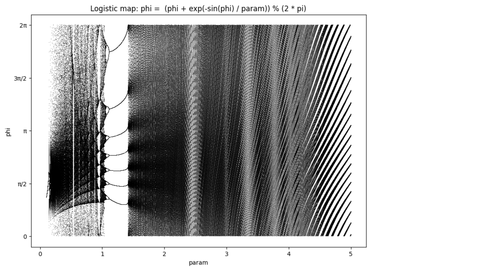
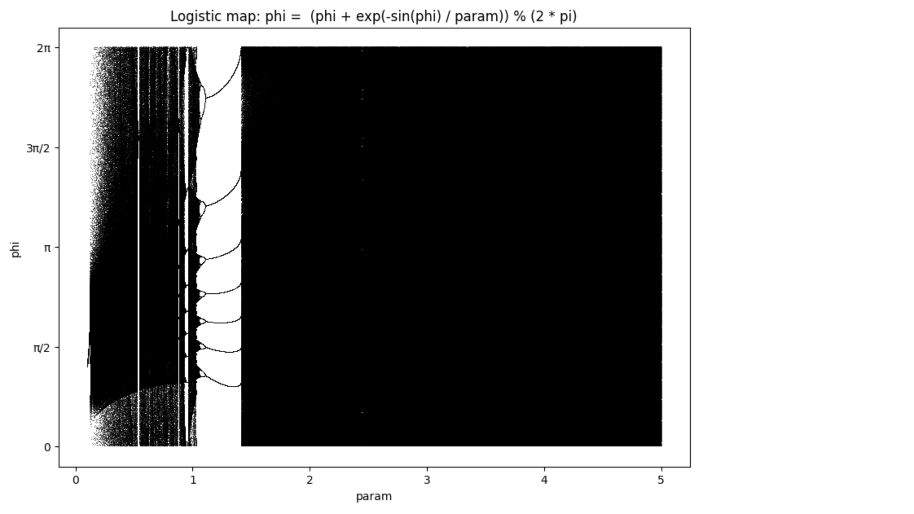

# Logistic map of ... process
The governing equation of the process is:
delta phi = exp( -sin(phi)/param )

Logistic map 200 iterations:

Logistic map 1000 iterations:

### Links
https://en.wikipedia.org/wiki/Logistic_map
